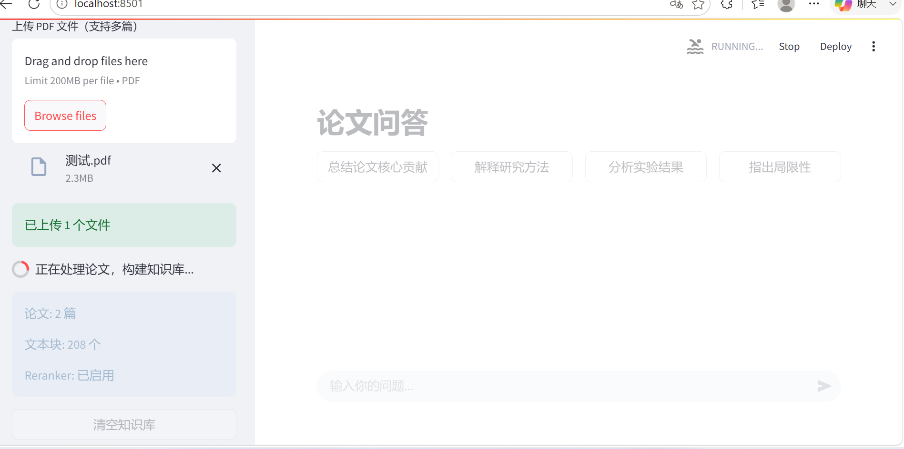
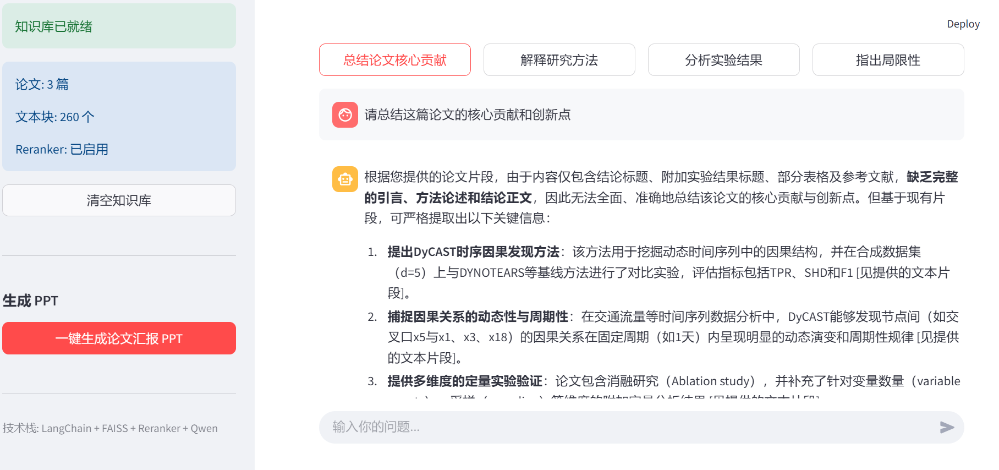
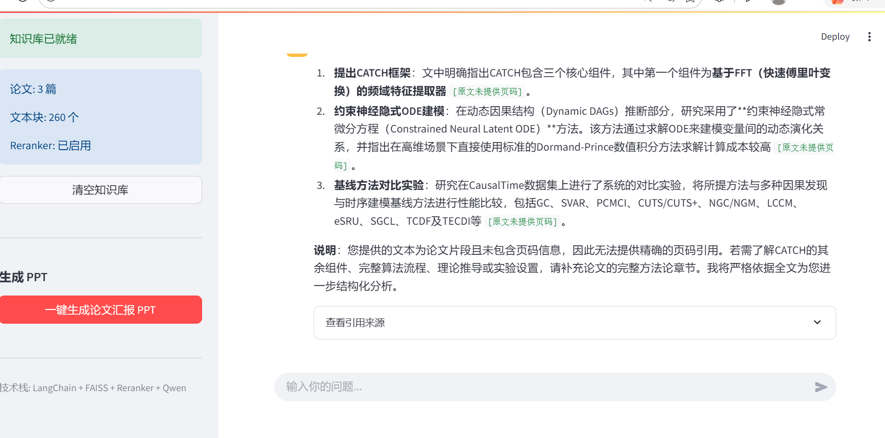
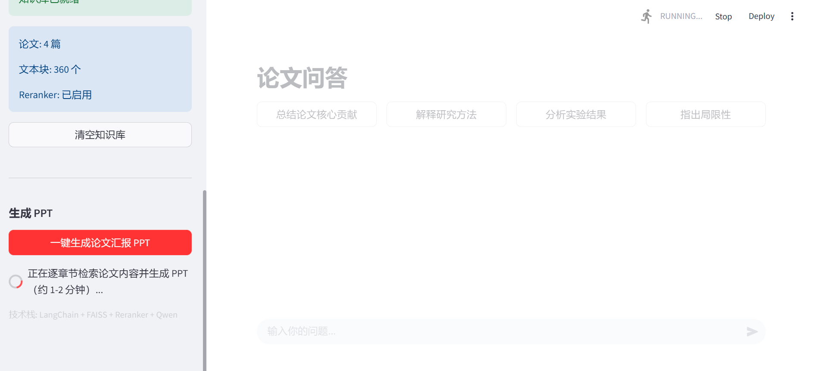
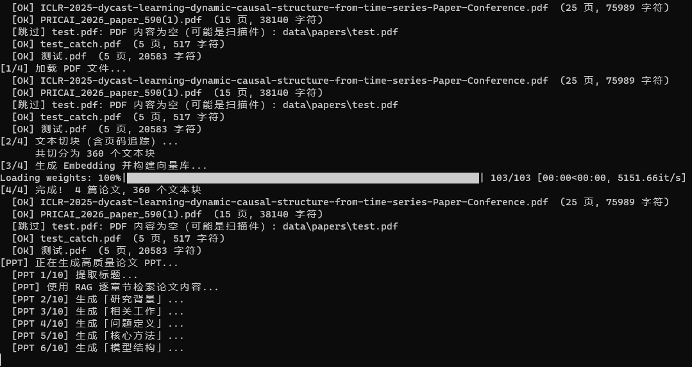
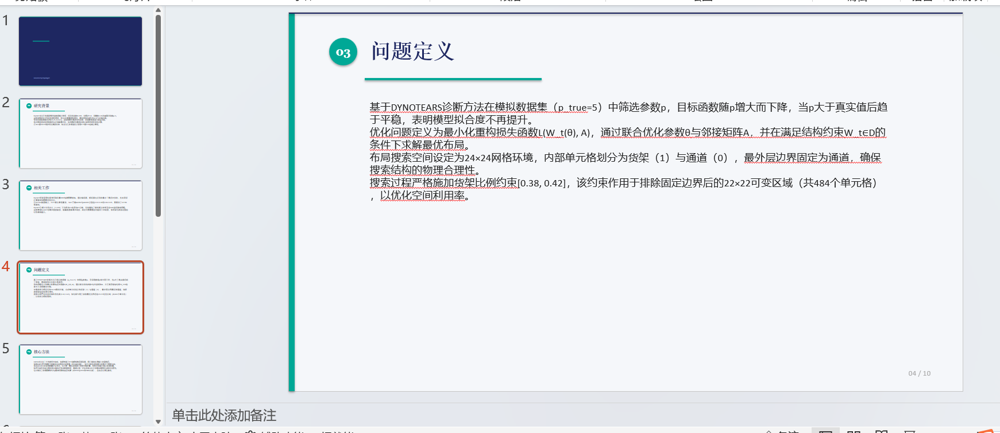

# PaperAgent v2.0

一个面向学术论文的可解释 RAG 应用：支持多 PDF 建库、FAISS 候选召回、CrossEncoder 重排、带页码的引用问答，并可逐章节检索论文内容后生成 10 页学术汇报 PPT。

> 项目定位：可解释论文 RAG 助手。当前版本不包含 Agent、Function Calling、缓存和异步任务。

## 效果演示

### 1. 多 PDF 上传与知识库构建

页面会展示已加载论文数、切分文本块数与 Reranker 状态。



### 2. 论文问答与快捷分析

提供“核心贡献”“研究方法”“实验结果”“局限性”四类快捷问题，也支持自由提问。



回答基于检索到的原文片段，并在“查看引用来源”中展示文件名、页码、相关性分数与原文摘要。



### 3. RAG 驱动的 PPT 生成

系统针对研究背景、相关工作、问题定义、核心方法、模型结构、算法流程、实验设置、实验结果与总结展望分别检索，再生成结构化要点和 `.pptx` 文件。







## 核心流程

```text
PDF 上传
  → PyMuPDF 按页提取文本
  → RecursiveCharacterTextSplitter 分块（500 / 100）
  → Embedding 并建立 FAISS 索引
  → FAISS 召回 Top-20 候选块
  → CrossEncoder 重排后保留 Top-4
  → 将原文、文件名和页码一起交给 Qwen
  → 生成可追溯回答 / 学术汇报 PPT
```

## 技术栈

- 界面：Streamlit
- RAG 编排：LangChain
- PDF 解析：PyMuPDF
- 向量检索：FAISS `IndexFlatIP`
- Embedding：本地 `all-MiniLM-L6-v2` 或 SiliconFlow 兼容 API
- 重排：`sentence-transformers` CrossEncoder，默认 `BAAI/bge-reranker-v2-m3`
- 大模型：OpenAI 兼容接口，默认通过 SiliconFlow 调用 Qwen
- PPT 渲染：python-pptx

## 本地运行

### 1. 创建环境并安装依赖

建议使用 Python 3.10–3.13；本项目已在 Python 3.13.5 下运行。

```bash
python -m venv .venv
```

Windows PowerShell：

```powershell
.\.venv\Scripts\Activate.ps1
pip install -r requirements.txt
```

### 2. 配置模型

复制 `.env.example` 为 `.env`，至少填写 `LLM_API_KEY`：

```dotenv
LLM_API_KEY=your_api_key
LLM_BASE_URL=https://api.siliconflow.cn/v1
LLM_MODEL=Qwen/Qwen3.6-35B-A3B

EMBEDDING_SOURCE=local
RERANKER_ENABLED=true
```

- `EMBEDDING_SOURCE=local`：首次运行会下载 Embedding 模型。
- 开启 Reranker 时，首次查询会下载并加载重排模型，需要等待一段时间。
- 设备内存较小时，可先设置 `RERANKER_ENABLED=false` 完成基础演示。

### 3. 启动

```powershell
streamlit run app.py
```

浏览器打开 `http://localhost:8501`。

## 项目结构

```text
PaperAgent/
├── app.py                 # Streamlit 页面与交互
├── config.py              # 模型、检索和分块参数
├── requirements.txt
├── .env.example           # 配置示例，不包含真实 Key
├── tests/smoke_test.py     # 无需调用 API 的本地烟雾测试
├── rag/
│   ├── pdf_loader.py      # 按页解析 PDF
│   ├── rag_engine.py      # 分块、Embedding、FAISS 与问答
│   ├── reranker.py        # CrossEncoder 重排
│   └── ppt_generator.py   # 逐章节检索与 PPT 渲染
└── docs/images/            # 实际运行截图
```

## 可调参数

| 参数 | 默认值 | 作用 |
|---|---:|---|
| `CHUNK_SIZE` | 500 | 单个文本块大小 |
| `CHUNK_OVERLAP` | 100 | 相邻文本块重叠长度 |
| `RERANKER_CANDIDATES` | 20 | FAISS 召回的候选数 |
| `RERANKER_TOP_N` | 4 | 重排后提供给 LLM 的文本块数 |
| `TOP_K` | 4 | 兼容保留参数 |

## 已知边界

- 纯扫描 PDF 暂不做 OCR，会跳过无可提取文本的文件。
- 页码是 PDF 文件的物理页序，可能与论文印刷页码不同。
- 生成式模型仍可能出错；应以“查看引用来源”中的原文片段为核验依据。
- 多篇论文会进入同一知识库；问题中最好写明论文名或方法名。
- PPT 目前为固定 10 页模板，复杂表格、公式和原文图片不会自动还原。

## 安全说明

- 不要提交 `.env`、真实 API Key、私有论文、向量索引或生成的 PPT。
- 仓库中只保留 `.env.example` 作为配置示例。

## 后续计划

- 建立小型检索评测集，报告 Recall@K / MRR 与 bad case。
- 增加 OCR 回退处理和知识库持久化。
- 优化 PPT 的图表、公式与原文图片引用。
- 补充可观测日志、超时重试和故障降级。

## License

本仓库当前未附带开源许可证，默认保留所有权利。
